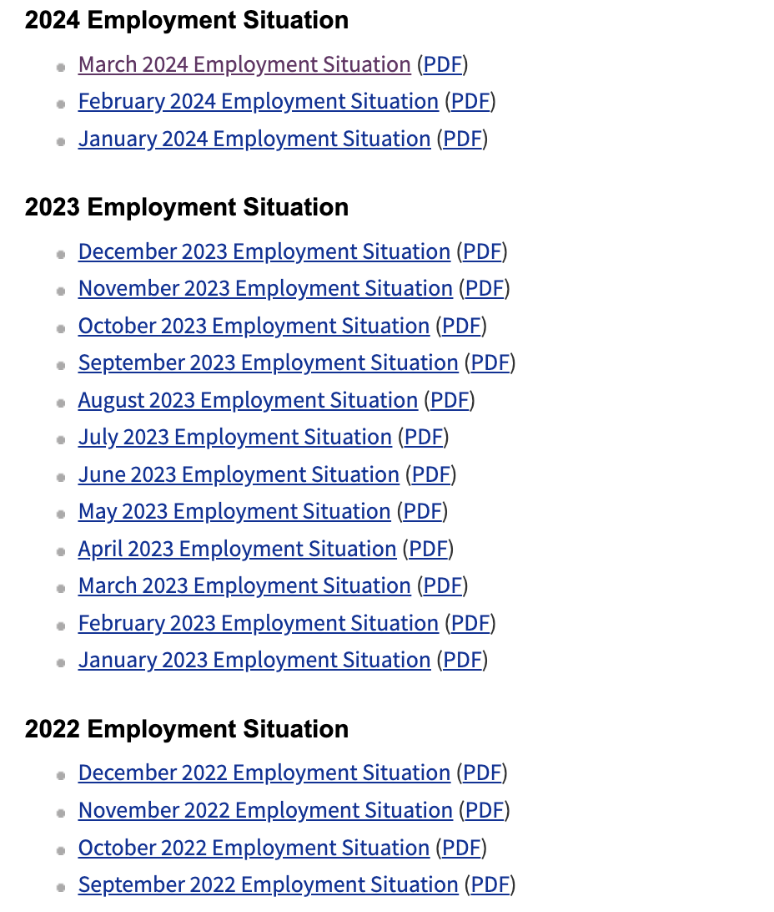
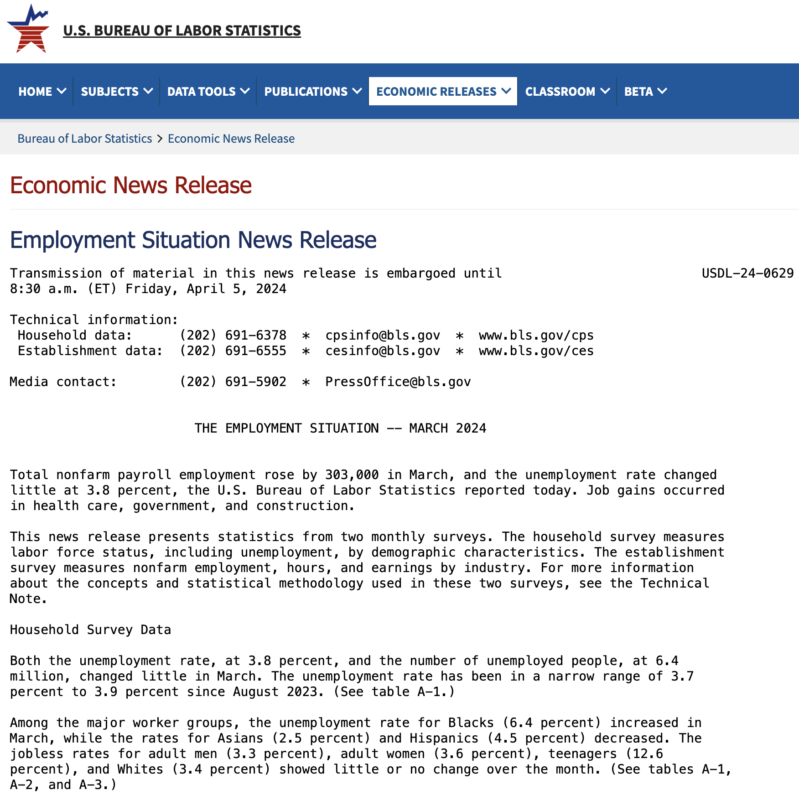
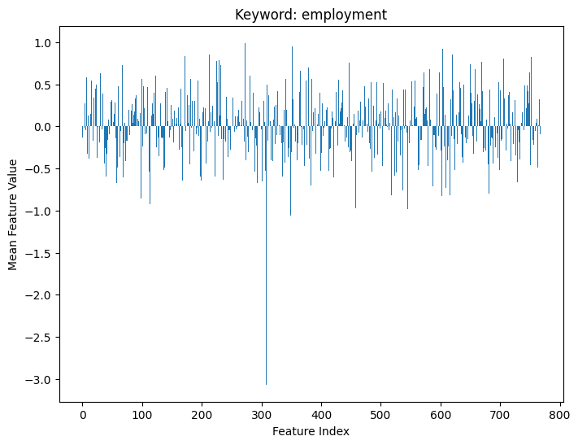
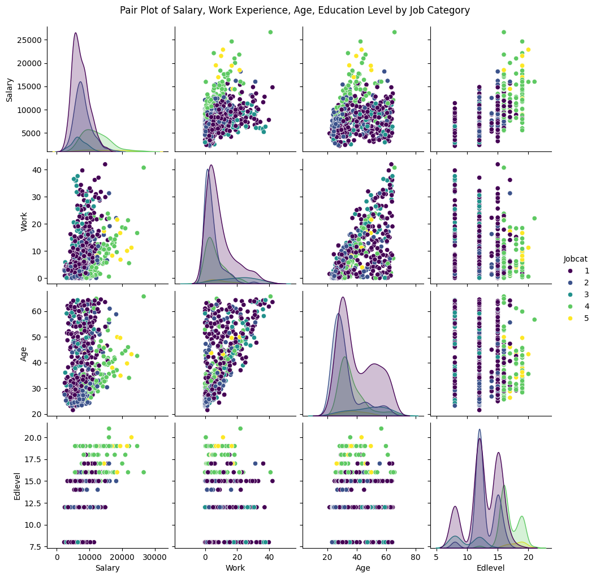
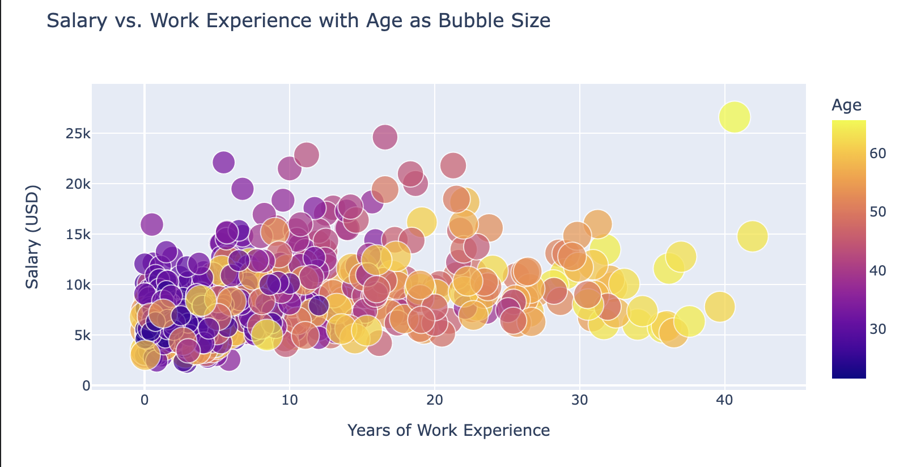
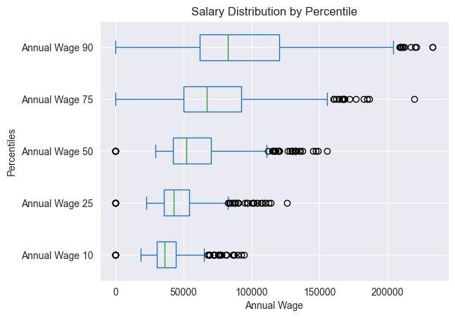
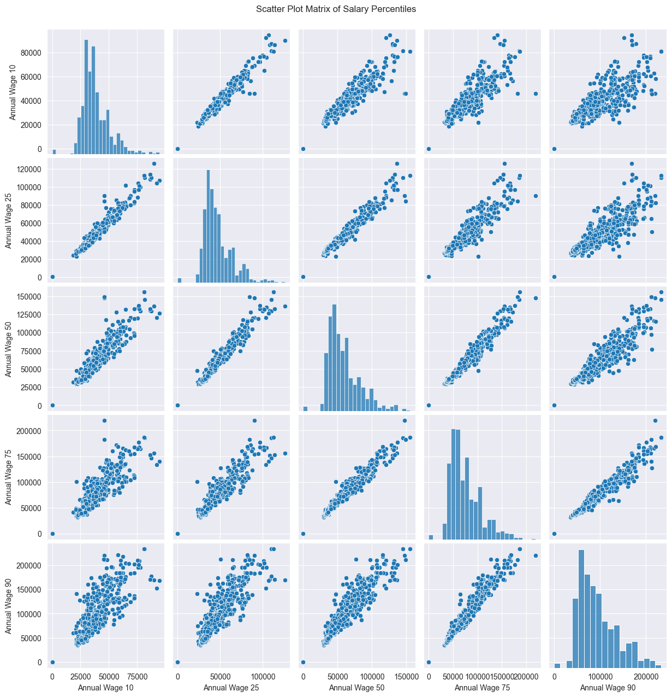
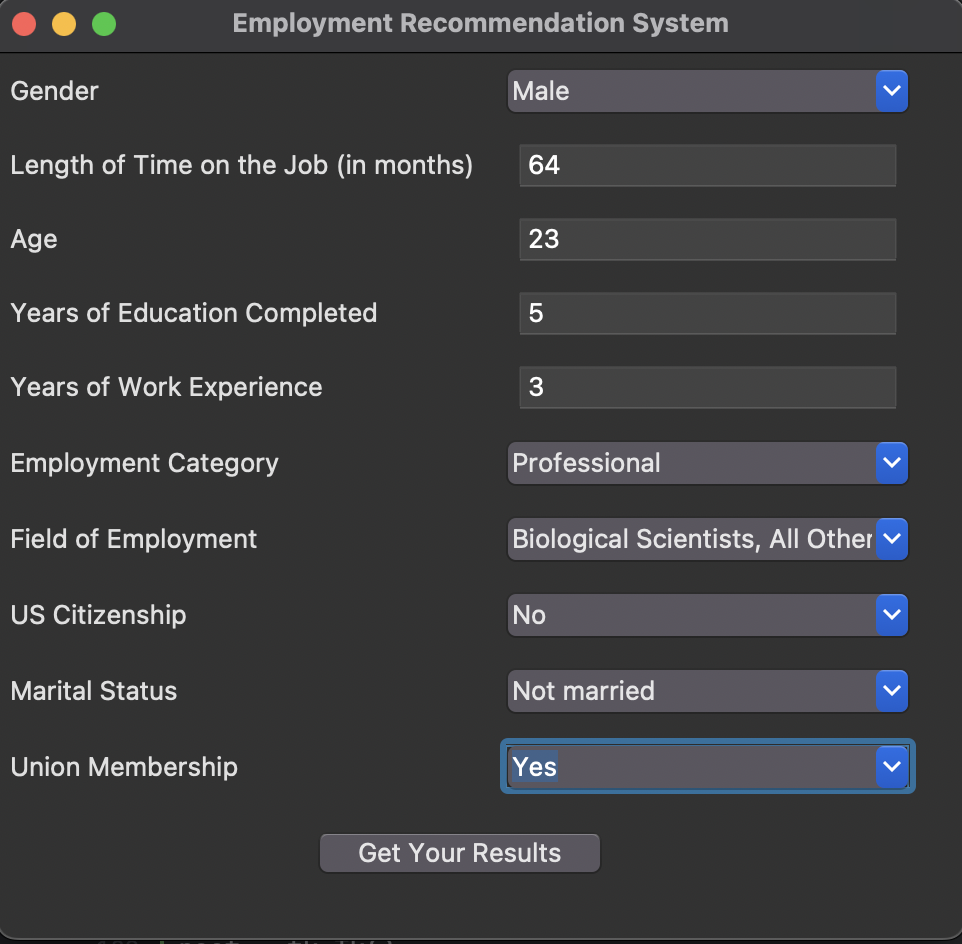
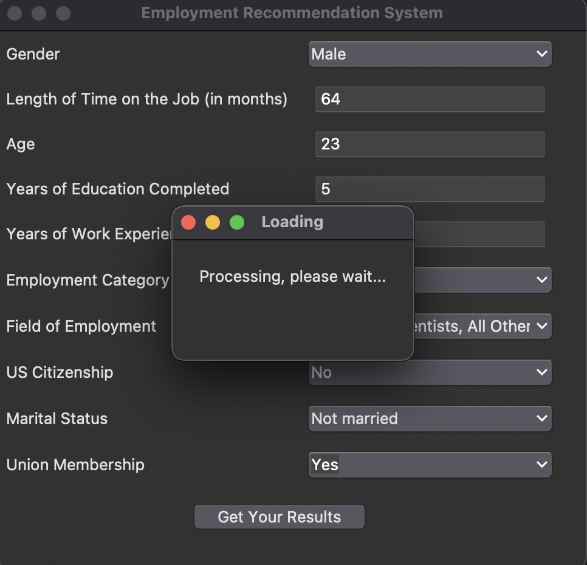

# Employment Analysis and Recommendation System Based on NLP and Data Modeling
### *CS 688 Project in 2024
### <u>*Author:</u> [Shuaijun Liu: — Click here to go to my Personal Web Page](https://shuaijun-liu.github.io/)

<p align="center">

</p>

## 1. Overview
<span style="color:#9370DB;">Welcome to my Employment Analysis and Recommendation System Based on NLP and Data Modeling project! </span>
### <span style="background-color:yellow; color:black;">1.1 Project Description</span>

Work plays a pivotal role in the lives of individuals and the functioning of societies. People engage in various occupations to sustain themselves, and the nature of work is continually evolving. 

Leveraging **NLP techniques** and **data modeling**, <u>this project aims to analyze text data from news releases and historical wage data from [the United States Bureau of Labor Statistics website](https://www.bls.gov/). By deciphering recent industry trends, employment figures, and wage changes, we provide career guidance. Simultaneously, statistical analysis and predictive modeling of wage data enable us to forecast future salary scenarios, offering valuable insights for individuals and policymakers. Ultimately, we aim to integrate these analyses into a recommendation system to assist users in making informed career decisions.
</u>

### <span style="background-color:yellow; color:black;">1.2 Guides</span> 
**<u>If you want to deploy my code and system on your local device or in the cloud, you need to read the Guides first. 
Make sure that all the necessary preparations have been completed.**</u>
1. [Environment Setup Guide](Environment_setup/Installing_Required_Packages.md)
2. [Web Scraping with Selenium Guide](Environment_setup/Web_Scraping_with_Selenium.md)


## 2. Project Components
### <span style="background-color:yellow; color:black;">2.1 Data Acquisition by Web Mining</span>
<div style="display: flex;">
    
    
</div>

- **News Release Text Data Acquisition**: Automated scripts use Selenium and BeautifulSoup to scrape news release texts from the BLS website. The script navigates the website, extracts relevant data, and stores it for analysis.

<span style="color:green;">Core Function:</span>
```python
# Parse names and URLs
news_releases = {}
for link in links:
    # Get the text as name
    name = link.get_text().strip()
    # Get the href attribute and concatenate the complete URL
    partial_url = link.get('href')
    # Ensure the link is a news release link and ends with .htm
    if "/news.release/archives/empsit" in partial_url and partial_url.endswith('.htm'):
        # Make sure to add a prefix only if the URL doesn't start with http:// or https://
        if not partial_url.startswith(('http:', 'https:')):
            full_url = base_url + partial_url
        else:
            full_url = partial_url  # URL is already complete
        # Save to the dictionary
        if name and full_url:
            news_releases[name] = full_url
```
The News Release URL Data is stored in the file: [data/News_Releases_URL.json](data/News_Releases_URL.json)
```json
{
    "March 2024 Employment Situation": "https://www.bls.gov/news.release/archives/empsit_04052024.htm",
    "February 2024 Employment Situation": "https://www.bls.gov/news.release/archives/empsit_03082024.htm",
    "January 2024 Employment Situation": "https://www.bls.gov/news.release/archives/empsit_02022024.htm",
    "December 2023 Employment Situation": "https://www.bls.gov/news.release/archives/empsit_01052024.htm",
    "November 2023 Employment Situation": "https://www.bls.gov/news.release/archives/empsit_12082023.htm",
    "October 2023 Employment Situation": "https://www.bls.gov/news.release/archives/empsit_11032023.htm",
    "September 2023 Employment Situation": "https://www.bls.gov/news.release/archives/empsit_10062023.htm",
    "August 2023 Employment Situation": "https://www.bls.gov/news.release/archives/empsit_09012023.htm",...
}
```
The News Release Text Data is stored in the file: [data/Text_Contents.json](data/Text_Contents.json)
```json
{"2024-03": "...Total nonfarm payroll employment rose by 303,000 in March, and the unemployment rate changed...",
"2024-02": "...Employment declined in the mining, quarrying, and oil and gas extraction\nindustry.\n\nThis news release presents statistics from two monthly surveys..."}
```
- **Industry Wage Data via API**: A Python script fetches detailed wage data from the BLS API using a series of API requests, which are customized to retrieve specific data based on user-defined parameters.

- **Web Crawl for Recent Jobs Data**: Utilizing Selenium, this script navigates to and extracts current job listings and descriptions from the BLS, capturing the diversity of employment opportunities and updating our database in real time.

<span style="color:green;">Core Function:</span>
```python
# Function to scrape job wage details
def scrape_job_details(driver, jobs):
    job_data = []
    for job in jobs:
        print(f"Processing {job['name']}...")
        driver.get(job['url'])
        driver.implicitly_wait(5)  # Waiting for page to load
        details = {'name': job['name'], 'code': job['code'], 'url': job['url']}
        
        # Use the presence of the 'tr:nth-child(3)' to determine the row for wage data
        row_selector = f"#oes{job['code'].lower()}_b > tbody > tr:nth-child(3)"
        if not driver.find_elements(By.CSS_SELECTOR, row_selector):
            # If 'tr:nth-child(3)' does not exist, use 'tr:nth-child(2)'
            row_selector = f"#oes{job['code'].lower()}_b > tbody > tr:nth-child(2)"
        
        wage_levels = ['10', '25', '50', '75', '90']
        for i, wage in enumerate(wage_levels, 2):
            try:
                wage_selector = f"{row_selector} > td:nth-child({i})"
                wage_value_element = driver.find_element(By.CSS_SELECTOR, wage_selector)
                wage_value = wage_value_element.text.strip().replace('$', '').replace(',', '')
                details[f'Annual Wage {wage}'] = wage_value
            except Exception as e:
                print(f"Failed to retrieve Annual Wage {wage} for {job['name']}. Error: {str(e)}")
                details[f'Annual Wage {wage}'] = "Data not available"
        print(details)
        job_data.append(details)
    return job_data
```
The Job Data is stored in the file: [data/Job_Directory.json](data/Job_Directory.json)
```json
[
    {
        "name": "Agents and Business Managers of Artists, Performers, and Athletes",
        "code": "13-1011",
        "url": "https://www.bls.gov/oes/current/oes131011.htm",
        "Annual Wage 10": " 47100",
        "Annual Wage 25": " 62280",
        "Annual Wage 50": " 84900",
        "Annual Wage 75": " 129930",
        "Annual Wage 90": "(5)"
    },
    {
        "name": "Buyers and Purchasing Agents",
        "code": "13-1020",
        "url": "https://www.bls.gov/oes/current/oes131020.htm",
        "Annual Wage 10": " 43680",
        "Annual Wage 25": " 54910",
        "Annual Wage 50": " 71950",
        "Annual Wage 75": " 94910",
        "Annual Wage 90": " 121680"
    }, 
  ...
]
```

### <span style="background-color:yellow; color:black;">2.2 Text Data Analysis by NLP</span>
I used NLTK and Bert to perform text processing on the text data of the press release, extract features, and model the topic through Latent Dirichlet Allocation. It loads and preprocesses the JSON data, and then prints out the extracted features, LDA topic modeling results, and bert extracted features.

<span style="color:green;">Core Function:</span>
```python
# Load pre-trained BERT model and tokenizer
model_name = 'bert-base-uncased'
tokenizer = BertTokenizer.from_pretrained(model_name)
model = BertModel.from_pretrained(model_name)
model.eval()  # Set to evaluation mode

# Define function to load and process JSON data
def load_data(filepath):
    with open(filepath, 'r') as file:
        data = json.load(file)
    return data

# Text preprocessing and feature extraction
def extract_features(text, keywords):
    # Tokenization
    tokenized_text = tokenizer.tokenize(text)
    max_len = 512
    step_size = 256

    # Handling overly long text
    chunks = [tokenized_text[i:i + max_len] for i in range(0, len(tokenized_text), step_size) if i + max_len <= len(tokenized_text)]

    keyword_features = {keyword: [] for keyword in keywords}
```

<div style="display: flex;">
    
    
</div>

### <span style="background-color:yellow; color:black;">2.3 Statistical Analysis, Data Preprocessing, and Visualization</span>

- **Visualization of Processed Wage Data**: Statistical tools and visualization techniques like box plots and heatmaps are used to analyze wage data. The `sns.boxplot` and `sns.heatmap` functions in Seaborn are specifically used to create insightful visualizations.

<p align="center">

</p>
<p align="center">

</p>

- **Job Data Cleaning and Visualization**: The job and wage data is cleaned using Pandas, where functions like `dropna()` and `fillna()` are employed to handle missing values, followed by using Seaborn and Matplotlib for visualizing this cleaned data to identify trends and outliers.

<p align="center">

</p>
<p align="center">

</p>

### <span style="background-color:yellow; color:black;">2.4 Model Training and Parameter Optimization</span>
- **Model Training and Evaluation**: Trained various models such as SVM, Random Forest, XGBoost, and LSTM using libraries like scikit-learn and TensorFlow. The performance of these models is evaluated using metrics such as MSE and R-squared to ensure robustness in predictions.

<span style="color:green;">Core Function:</span>
```python
# Create a DataFrame with evaluation results
data = {
    "Model": ["Support Vector Regression (SVM)", "Random Forest Regression", "Gradient Boosting Regression",
              "Naive Bayesian Regression", "Decision Tree Regression", "XGBoost Regression"],
    "Mean Squared Error": [svm_mse, rf_mse, gb_mse, nb_mse, dt_mse, xgb_mse],
    "Root Mean Squared Error": [svm_rmse, rf_rmse, gb_rmse, nb_rmse, dt_rmse, xgb_rmse],
    "Mean Absolute Error": [svm_mae, rf_mae, gb_mae, nb_mae, dt_mae, xgb_mae],
    "R-squared": [svm_r_squared, rf_r_squared, gb_r_squared, nb_r_squared, dt_r_squared, xgb_r2]
}

df = pd.DataFrame(data)grid_search = GridSearchCV(estimator=model, param_grid=param_grid, scoring='neg_mean_squared_error', cv=3, verbose=1)
```
| Model                           | Mean Squared Error | Root Mean Squared Error | Mean Absolute Error | R-squared |
|---------------------------------|--------------------|-------------------------|---------------------|-----------|
| Gradient Boosting Regression    | 2.14129e+06        | 1463.31                 | 1118.84             | 0.807303  |
| Random Forest Regression        | 2.39675e+06        | 1548.14                 | 1158.23             | 0.784313  |
| XGBoost Regression              | 2.50266e+06        | 1581.98                 | 1138.85             | 0.774782  |
| LSTM                            | 2.60343e+06        | 1723.67                 | 1243.92             | 0.752346  |
| Decision Tree Regression        | 3.85561e+06        | 1963.57                 | 1467.15             | 0.653028  |
| Naive Bayesian Regression       | 8.28683e+06        | 2878.68                 | 2085.56             | 0.254257  |
| Support Vector Regression (SVM) | 9.3496e+06         | 3057.71                 | 2140.58             | 0.158616  |


- **Parameter Optimization and Algorithm Selection**: Parameter optimization for XGBoost, Random Forest, and Gradient Boosting was performed using GridSearchCV, which systematically tested combinations of parameters to find the most effective settings for each model.

<span style="color:green;">Core Function:</span>
```python
# Define the model
model = XGBRegressor(objective='reg:squarederror')

# Define the parameter grid
param_grid = {
    'max_depth': [3, 4, 5, 6],
    'learning_rate': [0.01, 0.05, 0.1, 0.2],
    'gamma': [0, 0.1, 0.2, 0.3],
    'subsample': [0.7, 0.8, 0.9],
    'colsample_bytree': [0.7, 0.8, 0.9]
}

# Set up GridSearchCV
grid_search = GridSearchCV(estimator=model, param_grid=param_grid, scoring='neg_mean_squared_error', cv=3, verbose=1)
```


### <span style="background-color:yellow; color:black;">2.5 Wage Forecasting System Integration</span>
- **Construction of Wage Forecasting System**: Developed a GUI application using Tkinter that integrates the optimized XGBoost model. The application allows users to input data through a series of text boxes and combo boxes, processes this input using the `predict()` function of the model, and displays wage predictions and other relevant job market data to the user.

<span style="color:green;">Core Function:</span>
```python
# GUI Application
class WagePredictorApp:
    def __init__(self, master):
        self.master = master
        master.title("Employment Recommendation System")

        # Labels and Entry widgets for user inputs
        labels = ['Gender', 'Length of Time on the Job (in months)', 'Age', 
                  'Years of Education Completed', 'Years of Work Experience', 
                  'Employment Category', 'Field of Employment', 'US Citizenship', 
                  'Marital Status', 'Union Membership']
        self.entries = {}
        
        for i, label in enumerate(labels):
            ttk.Label(master, text=label).grid(row=i, column=0, sticky='w', padx=5, pady=5)
            if label == 'Employment Category' or label == 'Gender' or label == 'US Citizenship' or label == 'Marital Status' or label == 'Union Membership':
                # Dropdown menu for Employment Category
                if label == 'Employment Category':
                    values = ['Clerical', 'Sales', 'Service', 'Professional', 'Manager']
                elif label == 'Gender':
                    values = ['Male', 'Female', 'Other']  # Added 'Other' option
                elif label == 'US Citizenship':
                    values = ['Yes', 'No']
                elif label == 'Marital Status':
                    values = ['Married', 'Not married']
                elif label == 'Union Membership':
                    values = ['Yes', 'No']
                self.entries[label] = ttk.Combobox(master, values=values)
            elif label == 'Field of Employment':
                values = [job['name'] for job in job_data]
                self.entries[label] = ttk.Combobox(master, values=values)
            else:
                self.entries[label] = ttk.Entry(master)
            self.entries[label].grid(row=i, column=1, padx=5, pady=5)
```

## 3. Integrated System Demo
**Prediction and Results Display**:
   - Upon clicking the predict button, a loading window appears, simulating the processing time.
   - User inputs are collected from the GUI, processed, and converted into a format suitable for prediction.
   - The model predicts the user's wage based on their inputs. The prediction is compared with the dataset to determine the percentile ranking of the predicted wage.
   - A results window is then displayed, showing the predicted wage, its percentile, and additional information like a link to a detailed wage report for the user's field, leveraging the job data loaded earlier.

**Interactive Elements**:
   - The application includes interactive elements like clickable links that open in the user's default web browser, allowing them to view detailed reports.
   - The application ensures a good user experience by dynamically adjusting window sizes and positions based on the user's screen dimensions.

### Step 1: The user enters personal information and the information data is passed into the model. After the user clicks to get the result, the code in the algorithm section starts running.
<p align="center">

</p>

### Step 2: the model calls the dataset and algorithm parameters optimized to complete the prediction. During this time, the system will indicate that it is loading.
<p align="center">

</p>

### Step 3: The system summarizes the results, delivers them to the user through the UI interface, and generates a link to the recommended report, which the user can click on to get the latest wage report for the relevant industry.
<p align="center">

</p>

## 4. Conclusion

The Employment Analysis and Recommendation System is designed to be a robust tool that supports career decision-making by providing users with data-driven insights into potential career paths and salary expectations. Continually updated with new data and refined models, the system offers valuable support to individuals navigating the complex job market.


